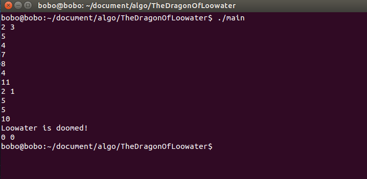

**（一）：勇者斗恶龙**

你的王国有一条n个头的恶龙，你希望顾一些骑士把他杀死（即砍掉所有的头）。村中有m个骑士可以雇佣，一个能力值位x的骑士可以砍掉恶龙一个直径不超过x的头，且需要支付x个金币。如何雇佣骑士才能砍掉恶龙的所有的头，且需要支付的金币最少？注意，一个骑士只能砍一个头（且不能被雇佣两次）。

【输入格式】
    输入包含多组数据。每组数据的第一行为正整数n和m(1 <= n,m <= 20000)；以下n行每行为一个整数，即恶龙每个头的直径；以下m行每行为一个整数，即每个骑士的能力。输入结束标志为n = 0,m = 0

【输出格式】
	对于每组数据，输出最少花费。如果无解，输出"Loowater is doomed!"。

【样例输入】
	2 3
    5
    4
    7
    8
    4
    2 1
    5
    5
    10
    0 0 

【样例输出】
	11
    Loowater is doomed!


**（二）：分析**

由于需要求得最小花费，而且骑士的能力和龙头的大小是对应的，所以需要将骑士的能力和龙的大小从小到大排列，然后进行一一匹配，如果骑士的能力超过龙头的大小，则可以雇佣，如果不行，就不能雇佣。当所有的骑士都被匹配了，再查看是否所有的龙头也都被匹配了。

**（三）：代码实现**

```

#include <stdio.h>
#include <stdlib.h>

int cmp(const void* a,const void* b)
{
    const int *arg1 = a;
    const int *arg2 = b;

    return *arg1 - *arg2;
}

int main()
{
	int n,m;
    int i,j;
    
    while(1){
        scanf("%d%d",&n,&m);
        
        if(n == 0 && m == 0)
            break;

        int *ns,*ms;
        ns = (int *)malloc(n * sizeof(int));
        ms = (int *)malloc(m * sizeof(int));

        for(i = 0;i < n;i++)
            scanf("%d",&ns[i]);

        for(i = 0;i < m;i++)
            scanf("%d",&ms[i]);

        qsort(ns,n,sizeof(int),cmp);
        qsort(ms,m,sizeof(int),cmp);

        int cur = 0; //需要砍掉的头的编号
        int cost = 0; //当前总费用

        for(i = 0;i < m;i++)
        {
            if(ms[i] >= ns[cur])
            {
                cost += ms[i];
                if(++cur == n) break;
            }
        }

        if(cur < n) printf("Loowater is doomed!\n");
        else printf("%d\n",cost);   
    }	

	return 0;
}

```

**（四）：程序运行结果**


